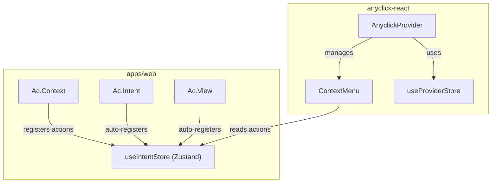

# Ac.Context + AnyclickProvider Integration

## Overview

Integrate `Ac.Context` with `AnyclickProvider` so that intent actions appear in the right-click context menu. Uses Zustand to maintain a dynamic registry of intents/actions that the context menu reads from.

## Architecture



---

## Data Model

### Action Definition

```ts
interface AcAction {
  /** Unique intent identifier */
  intent: string;
  /** Display label in context menu */
  label: string;
  /** Optional icon */
  icon?: ReactNode;
  /** Priority for sorting (1-10, where 10 = highest priority, default: 5) */
  priority?: number;
  /** Show comment input when selected */
  showComment?: boolean;
  /** Custom handler (return false to skip default submission) */
  handler?: (context: AcActionContext) => boolean | Promise<boolean | void> | void;
  /** Action status (available, comingSoon) */
  status?: "available" | "comingSoon";
  /** Required roles to see this action */
  requiredRoles?: string[];
}

interface AcActionContext {
  intent: string;
  metadata: Record<string, unknown>;
  targetElement: Element | null;
  containerElement: Element | null;
  closeMenu: () => void;
  /** Fire intent tracking event */
  track: () => void;
  /** Trigger screenshot capture */
  captureScreenshots: () => Promise<ScreenshotData>;
  /** Submit to anyclick adapter */
  submit: (comment?: string) => Promise<void>;
}
```

### Intent Registration

```ts
interface RegisteredIntent {
  /** The intent identifier */
  intent: string;
  /** Context ID this intent belongs to (for scoping) */
  contextId: string;
  /** Metadata from Ac.Context + Ac.Intent merged */
  metadata: Record<string, unknown>;
  /** DOM element ref for scoping */
  elementRef: RefObject<Element | null>;
  /** Whether this intent opts out of context menu (context={false}) */
  optOut: boolean;
  /** Event type (click, hover, view) */
  eventType: "click" | "hover" | "view";
}
```

---

## Store Design

### `useIntentStore` (Zustand)

```ts
interface IntentStore {
  // === Registry ===
  /** Map of contextId -> registered context */
  contexts: Map<string, RegisteredContext>;
  /** Map of intentId -> registered intent */
  intents: Map<string, RegisteredIntent>;
  
  // === Actions ===
  registerContext: (context: RegisteredContext) => void;
  unregisterContext: (contextId: string) => void;
  updateContext: (contextId: string, updates: Partial<RegisteredContext>) => void;
  
  registerIntent: (intent: RegisteredIntent) => void;
  unregisterIntent: (intentId: string) => void;
  
  // === Queries ===
  /** Get all actions for an element (walks up context tree) */
  getActionsForElement: (element: Element) => AcAction[];
  /** Get merged metadata for an element */
  getMetadataForElement: (element: Element) => Record<string, unknown>;
  /** Find nearest context for an element */
  findContextForElement: (element: Element) => RegisteredContext | null;
}

interface RegisteredContext {
  id: string;
  name?: string;
  metadata: Record<string, unknown>;
  actions: AcAction[];
  elementRef: RefObject<Element | null>;
  parentId: string | null;
  depth: number;
}
```

---

## Component Changes

### 1. `Ac.Context` - Enhanced

```tsx
interface AcContextProps {
  metadata: Record<string, unknown>;
  name?: string;
  /** Explicit actions for this context's menu */
  actions?: AcAction[];
  /** Disable anyclick in this context */
  disabled?: boolean;
  asChild?: boolean;
  children: ReactNode;
}
```

On mount:
1. Generate unique context ID
2. Find parent context (if any) via store
3. Register with `useIntentStore`
4. Merge parent metadata + actions

On unmount:
1. Unregister from store
2. Cleanup child intent registrations

### 2. `Ac.Intent` - Enhanced

```tsx
interface AcIntentProps {
  intent: string;
  on?: "click" | "hover" | "both";
  metadata?: Record<string, unknown>;
  /** Opt out of context menu registration */
  context?: boolean;  // default: true
  /** Action config when shown in context menu */
  action?: Partial<AcAction>;
  disabled?: boolean;
  children: React.ReactElement;
}
```

On mount (if `context !== false`):
1. Find parent Ac.Context
2. Register intent with store (contextId, metadata, elementRef)

### 3. `Ac.View` - Enhanced

Same as `Ac.Intent` but for view tracking.

---

## Integration with AnyclickProvider

### Option A: Bridge Component (Recommended for apps/web)

Create `<AcMenuBridge />` that reads from `useIntentStore` and injects actions into the nearest `AnyclickProvider`:

```tsx
function AcMenuBridge() {
  const { getActionsForElement } = useIntentStore();
  const anyclick = useAnyclick();
  
  // Hook into context menu open event
  // Merge Ac actions with provider's menuItems
  // ...
}
```

### Option B: Custom Hook

```tsx
function useAcContextMenu(element: Element | null) {
  const store = useIntentStore();
  
  return useMemo(() => {
    if (!element) return [];
    return store.getActionsForElement(element);
  }, [element, store]);
}
```

---

## Helper Functions

### Action Wrappers

```ts
/** Creates an action that fires tracking + submits to adapter */
function createTrackAndSubmitAction(
  intent: string,
  options?: { showComment?: boolean; label?: string }
): AcAction;

/** Creates an action that only fires tracking */
function createTrackOnlyAction(
  intent: string,
  options?: { label?: string }
): AcAction;

/** Creates an action that captures screenshots before submitting */
function createScreenshotAction(
  intent: string,
  options?: { showComment?: boolean; label?: string }
): AcAction;
```

### Usage Example

```tsx
<Ac.Context 
  name="packages"
  metadata={{ section: "packages" }}
  actions={[
    createTrackAndSubmitAction(HomepageIntent.PACKAGES_FEEDBACK, {
      label: "Report Issue",
      showComment: true,
    }),
    createScreenshotAction(HomepageIntent.PACKAGES_SCREENSHOT, {
      label: "Capture Screenshot",
    }),
  ]}
>
  <Ac.Intent 
    intent={HomepageIntent.PACKAGES_CARD_HOVER}
    on="hover"
    metadata={{ "package-name": pkg.name }}
    action={{ label: "View Package Details" }}  // Shows in menu
  >
    <PackageCard />
  </Ac.Intent>
</Ac.Context>
```

---

## File Structure

```
apps/web/src/components/tracking/
  - index.ts              # Exports Ac namespace + helpers
  - context.ts            # React context (existing)
  - store.ts              # NEW: Zustand intent store
  - AcContext.tsx         # Enhanced with registration
  - AcIntent.tsx          # Enhanced with registration
  - AcView.tsx            # Enhanced with registration
  - AcMenuBridge.tsx      # NEW: Bridge to AnyclickProvider
  - helpers.ts            # NEW: Action wrapper helpers
  - types.ts              # NEW: Shared types
```

---

## Implementation Order

1. **Create types.ts** - Define AcAction, RegisteredIntent, RegisteredContext
2. **Create store.ts** - Zustand store for intent/context registry
3. **Update Ac.Context** - Add registration, actions prop, parent detection
4. **Update Ac.Intent** - Add auto-registration, context prop, action prop
5. **Update Ac.View** - Same as Ac.Intent
6. **Create helpers.ts** - Action wrapper functions
7. **Create AcMenuBridge.tsx** - Integration with AnyclickProvider
8. **Update index.ts** - Export new components and helpers
9. **Update HomePageClient.tsx** - Add AcMenuBridge
10. **Test end-to-end** - Verify context menu shows Ac actions

---

## Decisions (Confirmed)

1. **Action ordering**: Actions have a `priority` value (1-10, where 10 = highest priority). Actions are sorted by priority descending in the menu.

2. **`context={false}` behavior**: Events still pass through the system, but all consumers (logging, tracking, menu actions) ignore intents with `context={false}`. This preserves flexibility for future use cases.

3. **Implementation scope**: Keep in `apps/web` until the pattern is fully proven, then promote to `anyclick-react` package.
