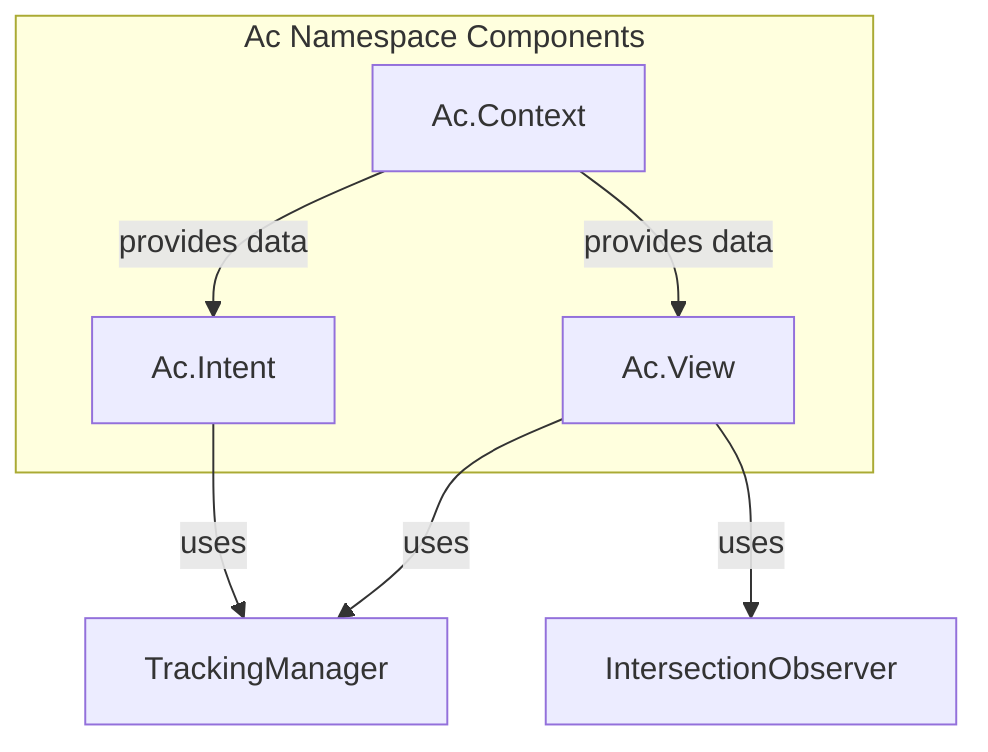

# Ac Intent Component Abstractions

## Problem

The current implementation requires repetitive boilerplate for intent tracking:

```tsx
// Current pattern - verbose and error-prone
<Link
  onClick={() => track(HomepageIntent.NAV_DOCS_CLICK)}
  data-ac-intent={HomepageIntent.NAV_DOCS_CLICK}
  className="pointer-none"
>
  Docs
</Link>
```

Each tracked element needs:

1. Manual `onClick`/`onMouseEnter` handler calling `track()`
2. Manual `data-ac-intent` attribute
3. Manual `data-ac-*` properties for context

## Solution

Create an `Ac` namespace with declarative components in [apps/web/src/components/tracking/](apps/web/src/components/tracking/):



---

## Components to Create

### 1. `Ac.Intent` - Click/Hover Tracking

Wraps interactive elements to automatically track clicks and hovers.

**Target usage (from TODOs):**

```tsx
// Wrapper pattern
<Ac.Intent intent={HomepageIntent.NAV_DOCS_CLICK}>
  <Link href="/docs">Docs</Link>
</Ac.Intent>

// With additional data
<Ac.Intent 
  intent={HomepageIntent.FOOTER_LINK_CLICK} 
  metadata={{ link: "docs" }}
>
  <Link href="/docs">Documentation</Link>
</Ac.Intent>

// Hover tracking (once per mount)
<Ac.Intent 
  intent={HomepageIntent.FEATURES_CARD_HOVER} 
  on="hover"
  metadata={{ featureId: feature.id }}
>
  <FeatureCard />
</Ac.Intent>
```

**Props:**

```ts
interface AcIntentProps {
  intent: string;                    // The intent identifier
  on?: "click" | "hover" | "both";   // Event type (default: "click")
  data?: Record<string, unknown>;    // Additional properties
  children: React.ReactElement;      // Single child (uses Slot/asChild pattern)
  disabled?: boolean;                // Disable tracking
}
```

**Implementation approach:**

- Use `@radix-ui/react-slot` for `asChild` pattern to merge props onto child
- Attach `onClick`/`onMouseEnter` handlers that call `track()`
- Set `data-ac-intent` and `data-ac-*` attributes for each key in `data`
- For `hover`, track only once per component mount

---

### 2. `Ac.Context` - Hierarchical Context Provider

Provides context data to nested `Ac.Intent` and `Ac.View` components.

**Target usage (from TODOs):**

```tsx
<Ac.Context metadata={{ section: "packages", discountCode:"code123" }}>
  {/* All nested intents inherit section="packages" in their data */}
  <Ac.Intent intent={HomepageIntent.PACKAGES_CARD_HOVER} metadata={{ packageName: pkg.name }}>
    <PackageCard />
  </Ac.Intent>
</Ac.Context>
```

**Props:**

```ts
interface AcContextProps {
  data: Record<string, unknown>;     // Context data merged into child intents
  name?: string;                     // Sets data-ac-context attribute
  children: React.ReactNode;
}
```

**Implementation approach:**

- Use React Context to provide data that flows to nested components
- Nested contexts merge data (inner overrides outer)
- Set `data-ac-context` attribute on wrapper div

---

### 3. `Ac.View` - Visibility/Section View Tracking

Tracks when an element enters the viewport.

**Target usage:**

```tsx
<Ac.View 
  intent={HomepageIntent.FEATURES_SECTION_VIEW} 
  threshold={0.3}
>
  <section>...</section>
</Ac.View>
```

**Props:**

```ts
interface AcViewProps {
  intent: string;                    // Intent to fire when visible
  threshold?: number;                // IntersectionObserver threshold (default: 0.5)
  once?: boolean;                    // Fire only once (default: true)
  minVisibleTime?: number;           // Minimum ms visible before firing
  data?: Record<string, unknown>;    // Additional properties
  children: React.ReactElement;
}
```

**Implementation approach:**

- Wrap existing `useSectionView` hook logic
- Use `Slot` pattern to attach ref to child
- Merge context data from `Ac.Context`

---

## File Structure

```
apps/web/src/components/tracking/
  - index.ts          # Export Ac namespace
  - AcIntent.tsx      # Click/hover tracking component
  - AcContext.tsx     # Context provider component  
  - AcView.tsx        # View tracking component
  - context.ts        # React context for Ac.Context data
```

---

## Refactoring Examples

### Before (HomePageClient.tsx):

```tsx
<Link
  href="/docs"
  onClick={() => track(HomepageIntent.NAV_DOCS_CLICK)}
  data-ac-intent={HomepageIntent.NAV_DOCS_CLICK}
>
  Docs
</Link>
```

### After:

```tsx
<Ac.Intent href="/docs" intent={HomepageIntent.NAV_DOCS_CLICK}>
Docs
</Ac.Intent>
```

### Before (FeaturesSection.tsx):

```tsx
<div
  onMouseEnter={handleMouseEnter}
  data-ac-intent={HomepageIntent.FEATURES_CARD_HOVER}
  data-ac-feature={feature.id}
>
```

### After:

```tsx
<Ac.Intent 
  intent={HomepageIntent.FEATURES_CARD_HOVER} 
  on="hover"
  metadata={{ feature: feature.id }}
>
  <div>...</div>
</Ac.Intent>
```

---

## Dependencies

- `@radix-ui/react-slot` - Already used in codebase for `asChild` pattern
- Existing `@/lib/tracking` hooks - Reuse `getTrackingManager()`