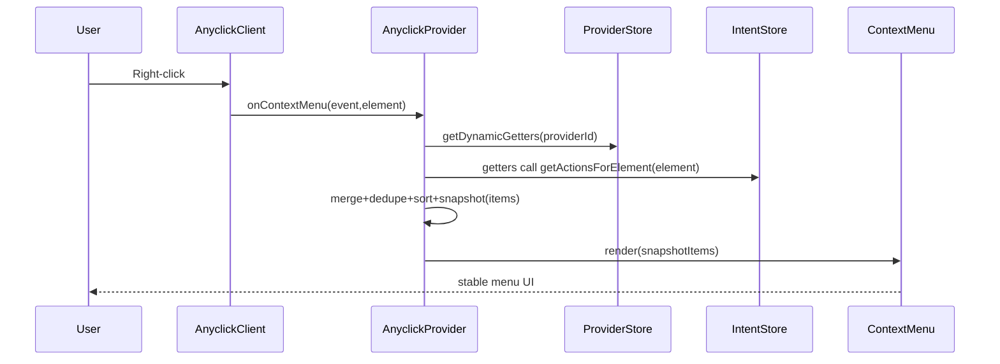

# AnyclickProvider Dynamic Menu Integration (Provider-Scoped Registration)

## Goal

Enable `apps/web` intent actions (from `apps/web/src/components/tracking/`) to appear in the Anyclick right-click menu with a **drop-in** pattern:

- Developer adds `<AcMenuBridge />` anywhere inside `<AnyclickProvider>`
- `AcMenuBridge` registers a dynamic menu getter with the **nearest provider**
- When user right-clicks, the provider **snapshots** dynamic items for the clicked element and renders a stable merged menu

This avoids requiring app-level wiring (passing props down to `AnyclickProvider`) and behaves correctly with **nested providers/scopes**.

---

## Key Design Decisions (critical)

- **Provider-scoped registration**: dynamic menu getters are stored per `providerId` (supports nested providers safely).
- **Snapshot on open**: call getters once when the menu opens; the menu should not reshape while open (submenu UX correctness).
- **Stable identity**: introduce `ContextMenuItem.id` (or equivalent) and dedupe/React keys must not rely on `type` alone.
- **Priority sort**:
                                - priority range 1–10 (10 highest), default 5
                                - stable sort (tie-breaker preserves original order; optionally prefer static vs dynamic)
                                - apply recursively to submenu `children`
- **Type semantics**:
                                - `AnyclickType` supports custom strings (`BuiltInAnyclickType | (string & {})`), so using intent strings as `type` is allowed.
                                - treat `type` as submission type only when the default flow runs; custom items can short-circuit via `onClick` returning `false`.

---

## Architecture



---

## Planned Code Changes

### 1) Define the public API surface

#### Update [packages/anyclick-react/src/types.ts](packages/anyclick-react/src/types.ts)

- Add stable identity + priority:
```ts
export interface ContextMenuItem {
  /** Stable unique id for React keys + dedupe (recommended) */
  id?: string;

  /** Priority for sorting (1-10, 10 highest, default: 5) */
  priority?: number;

  // existing fields remain
}
```

- Add provider-level registration to context (so a child bridge can register itself):
```ts
export interface AnyclickContextValue {
  // ...existing fields

  /**
   * Register a dynamic menu getter for this provider.
   * Returns an unregister function.
   */
  registerDynamicMenuItems?: (
    getter: (element: Element) => ContextMenuItem[],
  ) => () => void;
}
```

- Optional: expose `userContext` in provider props so `requiredRoles` is actually enforced:
```ts
export interface AnyclickProviderProps {
  // ...existing fields
  userContext?: AnyclickUserContext;

  /** Optional direct injection (still useful for app-level configuration) */
  dynamicMenuItems?: (element: Element) => ContextMenuItem[];
}
```


Rationale:

- `registerDynamicMenuItems` enables true bridge-component wiring.
- Keeping `dynamicMenuItems` as a prop is still useful for explicit app-level configuration.

---

### 2) Provider-scoped dynamic getter registry

#### Update [packages/anyclick-react/src/store.ts](packages/anyclick-react/src/store.ts)

Extend `ProviderInstance` and store actions so each provider can own multiple registered getters:

- Add to `ProviderInstance`:
                                - `dynamicMenuItemGetters?: Map<string, (element: Element) => ContextMenuItem[]>`

- Add store actions:
                                - `registerDynamicMenuItems(providerId, getterId, getter)`
                                - `unregisterDynamicMenuItems(providerId, getterId)`
                                - `getDynamicMenuItems(providerId, element)` convenience that fans out and flattens results

Notes:

- Getter IDs can be generated with a simple counter.
- Storing in the provider registry ensures nested-provider routing (already present) naturally applies.

---

### 3) Snapshot merged items when opening the menu

#### Update [packages/anyclick-react/src/AnyclickProvider.tsx](packages/anyclick-react/src/AnyclickProvider.tsx)

Add state:

- `const [resolvedMenuItems, setResolvedMenuItems] = useState<ContextMenuItem[]>(menuItems)`

When the context menu opens (`handleContextMenu` and `openMenu`):

- Build `dynamicFromProp` if `dynamicMenuItems` is provided
- Build `dynamicFromRegistry` from `useProviderStore.getState()` registered getters for this `providerId`
- Merge: `staticItems + dynamicItems`
- Normalize:
                                - assign `id` if missing (e.g. `auto:${type}:${label}:${index}`)
                                - dedupe by `id` (preferred) else by `type+label`
                                - stable sort by `priority` desc (tie-breaker preserves original order)
                                - sort recursively for `children`
                                - optionally apply `filterMenuItemsByRole` if `userContext` is provided (recursive)
- Snapshot: `setResolvedMenuItems(normalized)`

Then render:

- `ContextMenu items={resolvedMenuItems}`

Also fix the existing prop passthrough gap:

- pass `menuPositionMode` into ContextMenu as `positionMode={menuPositionMode}`.

---

### 4) ContextMenu robustness (keys, no mid-open mutation)

#### Update [packages/anyclick-react/src/ContextMenu.tsx](packages/anyclick-react/src/ContextMenu.tsx)

- Use stable key:
                                - change `key={item.type}` to `key={item.id ?? item.type}` (provider normalization must ensure uniqueness)

- Keep dynamic logic out of ContextMenu:
                                - ContextMenu should trust `items` are already merged/sorted.
                                - This prevents submenu bugs when the root items array changes while open.

---

### 5) Make AcMenuBridge self-register with nearest provider

#### Update [apps/web/src/components/tracking/AcMenuBridge.tsx](apps/web/src/components/tracking/AcMenuBridge.tsx)

- Remove the `onRegisterActions` prop pattern.
- Instead, import `useAnyclick` from `@ewjdev/anyclick-react` and register in an effect:
                                - `const anyclick = useAnyclick()`
                                - `anyclick.registerDynamicMenuItems?.(getActions)`

Also ensure menu items have stable identity + priority:

- In `convertToMenuItem`:
                                - set `id` to something stable like `ac:${action.intent}` (or include label if multiple actions could share intent)
                                - set `priority: action.priority`

This makes the integration truly declarative:

```tsx
<AnyclickProvider adapter={adapter}>
  <AcMenuBridge />
  <App />
</AnyclickProvider>
```

---

## Rollout / Compatibility

- **Backwards compatible**:
                                - existing `menuItems` continues to work
                                - adding optional `id` and `priority` does not break existing callers
                                - `registerDynamicMenuItems` is additive to context

- **Behavior changes**:
                                - once role filtering is applied (only when `userContext` provided), `requiredRoles` becomes enforced

---

## Test Plan

- Static menu items render and submit as before.
- Dynamic injection: right-click inside an `Ac.Context` shows Ac actions.
- Nested providers: dynamic items resolve from the nearest provider only.
- Snapshot correctness: while menu open (including submenus), item list does not reorder/change.
- Keys/dedupe: no React warnings; duplicates do not render twice when `id` matches.
- Priority: higher priority appears first; ties preserve stable order; children sorted too.
- Role filtering (if enabled): items with `requiredRoles` are hidden without matching roles.
- Position mode: `menuPositionMode` affects ContextMenu as expected.