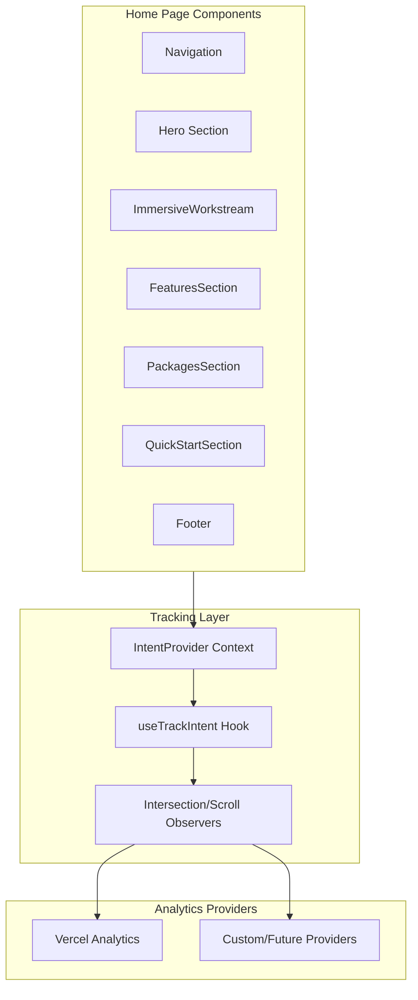

# Home Page Intent Tracking Integration

## Architecture Overview



## 1. Create Web-Specific Intents

Create `apps/web/src/lib/intents/` with homepage-specific intents that may later be promoted to the protocol package.

**File: `apps/web/src/lib/intents/homepage.ts`**

```typescript
export enum HomepageIntent {
  // Navigation
  NAV_LOGO_CLICK = "web.homepage.nav.logo.click",
  NAV_DOCS_CLICK = "web.homepage.nav.docs.click",
  NAV_EXAMPLES_CLICK = "web.homepage.nav.examples.click",
  NAV_GITHUB_CLICK = "web.homepage.nav.github.click",
  NAV_GET_STARTED_CLICK = "web.homepage.nav.getStarted.click",

  // Hero Section
  HERO_VIEW = "web.homepage.hero.view",
  HERO_CTA_CLICK = "web.homepage.hero.cta.click",
  HERO_CODE_COPY = "web.homepage.hero.code.copy",

  // Immersive Workstream
  WORKSTREAM_SECTION_VIEW = "web.homepage.workstream.section.view",
  WORKSTREAM_NAV_CLICK = "web.homepage.workstream.nav.click",
  WORKSTREAM_CARD_INTERACT = "web.homepage.workstream.card.interact",

  // Features Section
  FEATURES_SECTION_VIEW = "web.homepage.features.section.view",
  FEATURES_CARD_HOVER = "web.homepage.features.card.hover",

  // Packages Section
  PACKAGES_SECTION_VIEW = "web.homepage.packages.section.view",
  PACKAGES_CARD_HOVER = "web.homepage.packages.card.hover",

  // Quick Start Section
  QUICKSTART_SECTION_VIEW = "web.homepage.quickstart.section.view",
  QUICKSTART_CODE_COPY = "web.homepage.quickstart.code.copy",
  QUICKSTART_DOCS_CLICK = "web.homepage.quickstart.docs.click",

  // Roadmap Summary
  ROADMAP_SECTION_VIEW = "web.homepage.roadmap.section.view",
  ROADMAP_FEATURE_REQUEST_CLICK = "web.homepage.roadmap.featureRequest.click",
  ROADMAP_LINK_CLICK = "web.homepage.roadmap.link.click",

  // Footer
  FOOTER_VIEW = "web.homepage.footer.view",
  FOOTER_LINK_CLICK = "web.homepage.footer.link.click",

  // Engagement Metrics
  SCROLL_DEPTH_25 = "web.homepage.scroll.depth.25",
  SCROLL_DEPTH_50 = "web.homepage.scroll.depth.50",
  SCROLL_DEPTH_75 = "web.homepage.scroll.depth.75",
  SCROLL_DEPTH_100 = "web.homepage.scroll.depth.100",
  TIME_ON_PAGE_30S = "web.homepage.engagement.time.30s",
  TIME_ON_PAGE_60S = "web.homepage.engagement.time.60s",
  TIME_ON_PAGE_120S = "web.homepage.engagement.time.120s",
}
```

## 2. Build Custom Tracking Layer

**File: `apps/web/src/lib/tracking/`**

### Core Types (`types.ts`)

```typescript
export interface TrackingEvent {
  intent: string;
  timestamp: string;
  sessionId: string;
  properties?: Record<string, unknown>;
  engagement?: {
    scrollDepth?: number;
    timeOnSection?: number;
    viewportVisible?: boolean;
  };
}

export interface TrackingProvider {
  name: string;
  track: (event: TrackingEvent) => void | Promise<void>;
  identify?: (userId: string, traits?: Record<string, unknown>) => void;
}
```

### Tracking Manager (`manager.ts`)

- Singleton pattern for managing providers
- Batching events for performance
- Session management
- Provider registration (Vercel, custom, future)

### Vercel Provider (`providers/vercel.ts`)

```typescript
import { track } from '@vercel/analytics';

export const vercelProvider: TrackingProvider = {
  name: 'vercel',
  track: (event) => {
    track(event.intent, {
      ...event.properties,
      sessionId: event.sessionId,
      engagement: event.engagement,
    });
  },
};
```

### React Integration (`hooks/useTrackIntent.ts`)

```typescript
export function useTrackIntent() {
  const track = (intent: string, properties?: Record<string, unknown>) => { ... };
  const trackView = (intent: string, ref: RefObject<Element>) => { ... };
  const trackEngagement = (sectionId: string) => { ... };
  return { track, trackView, trackEngagement };
}
```

## 3. Create IntentProvider Context

**File: `apps/web/src/components/IntentProvider.tsx`**

- Wraps the app to provide tracking context
- Manages scroll depth tracking
- Handles time-on-page metrics
- Uses Intersection Observer for section views

## 4. Update Home Page Components

### Components to Update

| Component | Intents to Add | Type |

|-----------|---------------|------|

| `page.tsx` | Wrap with IntentProvider, scroll depth | Container |

| Navigation (in page.tsx) | NAV_* intents | Active |

| Hero Section | HERO_VIEW, HERO_CTA_CLICK, HERO_CODE_COPY | Active + Passive |

| `ImmersiveWorkstreamShowcase` | WORKSTREAM_* intents | Active + Passive |

| `FeaturesSection` | FEATURES_* intents | Passive + Hover |

| `PackagesSection` | PACKAGES_* intents | Passive + Hover |

| `QuickStartSection` | QUICKSTART_* intents | Active + Passive |

| `RoadmapSummary` | ROADMAP_* intents | Active + Passive |

| Footer | FOOTER_* intents | Active + Passive |

### Pattern for Adding Intents

```tsx
// Active interaction example
<Link 
  href="/docs" 
  onClick={() => track(HomepageIntent.NAV_DOCS_CLICK)}
  data-ac-intent={HomepageIntent.NAV_DOCS_CLICK}
>
  Docs
</Link>

// Passive view example (using ref + IntersectionObserver)
<section 
  ref={sectionRef}
  data-ac-intent={HomepageIntent.FEATURES_SECTION_VIEW}
  data-ac-context="features"
>
  <FeaturesSection />
</section>
```

## 5. Install Dependencies

```bash
yarn workspace web-app add @vercel/analytics
```

## Key Files to Create/Modify

### New Files

- `apps/web/src/lib/intents/homepage.ts` - Homepage-specific intents
- `apps/web/src/lib/intents/index.ts` - Intent exports
- `apps/web/src/lib/tracking/types.ts` - Tracking types
- `apps/web/src/lib/tracking/manager.ts` - Tracking manager
- `apps/web/src/lib/tracking/providers/vercel.ts` - Vercel provider
- `apps/web/src/lib/tracking/hooks/useTrackIntent.ts` - React hook
- `apps/web/src/lib/tracking/hooks/useScrollDepth.ts` - Scroll tracking
- `apps/web/src/lib/tracking/hooks/useSectionView.ts` - Section view tracking
- `apps/web/src/lib/tracking/index.ts` - Exports
- `apps/web/src/components/IntentProvider.tsx` - Context provider

### Files to Modify

- `apps/web/src/app/layout.tsx` - Add Vercel Analytics and IntentProvider
- `apps/web/src/app/page.tsx` - Add intents to nav, hero, footer, wrap sections
- `apps/web/src/components/FeaturesSection.tsx` - Add section view + card hover intents
- `apps/web/src/components/PackagesSection.tsx` - Add section view + card hover intents
- `apps/web/src/components/QuickStartSection.tsx` - Add intents
- `apps/web/src/components/RoadmapSummary.tsx` - Add intents
- `apps/web/src/components/ImmersiveWorkstreamShowcase.tsx` - Re-export with intents
- `apps/web/src/components/immersive-workstream/ImmersiveWorkstreamShowcase.tsx` - Add intents
- `apps/web/src/components/CodePreview.tsx` - Add copy intent tracking