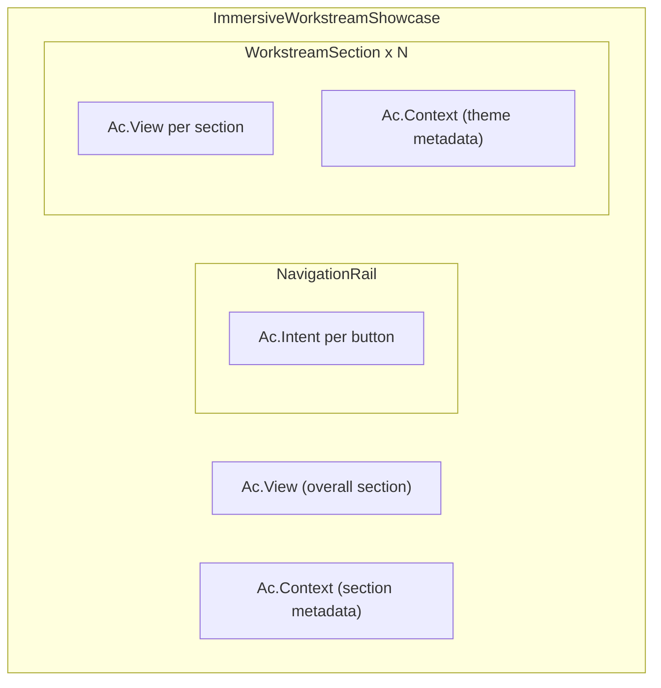

# Refactor ImmersiveWorkstreamShowcase to Use Ac Components

## Current State

[`ImmersiveWorkstreamShowcase.tsx`](apps/web/src/components/immersive-workstream/ImmersiveWorkstreamShowcase.tsx) currently uses imperative tracking:

1. `useSectionViewWithRef` hook for overall section view (line 24-27)
2. Direct `track()` calls in `useEffect` for individual section views (lines 57-69)
3. Direct `track()` call in `handleNavigate` for navigation clicks (lines 115-121)

## Target Architecture



## Changes Required

### 1. ImmersiveWorkstreamShowcase.tsx

**Remove:**

- `useTrackIntent` hook import and usage
- `useSectionViewWithRef` hook and related refs
- Individual section tracking logic in `useEffect` (lines 50-77 intersection observer for tracking)
- Direct `track()` call in `handleNavigate`

**Add:**

- Wrap container with `Ac.View` for overall section view tracking
- Wrap with `Ac.Context` to provide base metadata

**Simplified structure:**

```tsx
<Ac.View intent={HomepageIntent.WORKSTREAM_SECTION_VIEW} threshold={0.1}>
  <Ac.Context metadata={{ section: "workstream" }}>
    <div ref={containerRef} className={cn("relative", className)}>
      <NavigationRail ... onNavigate={handleNavigate} />
      {immersiveThemes.map((theme, index) => (
        <WorkstreamSection key={theme.id} theme={theme} index={index} />
      ))}
    </div>
  </Ac.Context>
</Ac.View>
```

### 2. WorkstreamSection.tsx

Add `Ac.View` wrapper to track individual section views:

```tsx
import { Ac } from "@/components/tracking";
import { HomepageIntent } from "@/lib/intents";

// Wrap the section element with Ac.View
<Ac.View
  intent={HomepageIntent.WORKSTREAM_CARD_INTERACT}
  threshold={0.1}
  metadata={{
    action: "view",
    sectionId: theme.id,
    sectionTitle: theme.title,
  }}
>
  <section ref={sectionRef} id={theme.id} ...>
    {/* existing content */}
  </section>
</Ac.View>
```

### 3. NavigationRail.tsx

Add `Ac.Intent` for navigation click tracking:

```tsx
import { Ac } from "@/components/tracking";
import { HomepageIntent } from "@/lib/intents";

// Each navigation button wrapped with Ac.Intent
<Ac.Intent
  intent={HomepageIntent.WORKSTREAM_NAV_CLICK}
  metadata={{
    sectionIndex: index,
    sectionId: theme.id,
    sectionTitle: theme.title,
  }}
>
  <button onClick={() => onNavigate(index)} ...>
    {/* existing content */}
  </button>
</Ac.Intent>
```

## Summary of Abstractions Used

| Component | Purpose | Replaces |

|-----------|---------|----------|

| `Ac.View` | Track element visibility | `useSectionViewWithRef`, custom IntersectionObserver |

| `Ac.Intent` | Track click interactions | Direct `track()` calls |

| `Ac.Context` | Provide hierarchical metadata | Manual metadata merging |

No new abstractions needed - existing `Ac.View`, `Ac.Intent`, and `Ac.Context` components cover all use cases.