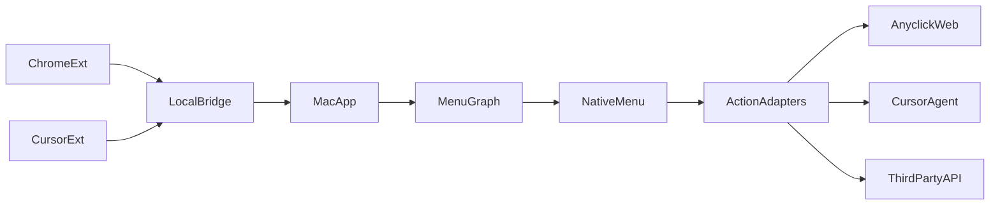

# SwiftUI Anyclick Menu Plan

## Feasibility Notes

- This is feasible with app‑specific integrations. The repo already has menu modeling (`ContextMenuItem`) and extension‑side right‑click interception that can be reused as the semantic model and context capture pattern for a native SwiftUI menu.
- A global system‑wide menu would require Accessibility/event taps; with your app‑specific choice we can avoid those and integrate per app (Chrome extension + Cursor plugin) while still presenting a native macOS menu.

## Key Existing References (reuse/adapt)

- Menu item modeling: `ContextMenuItem` in `packages/anyclick-react/src/types.ts` and `ExtensionMenuItem` in `packages/anyclick-extension/src/contextMenu.ts`.
- Right‑click interception in Chrome extension: `packages/anyclick-extension/src/content.ts`.
- Intent/protocol semantics to map actions: `packages/anyclick-protocol/src/spec.ts`.

## Plan

1. **Define the local menu graph & action schema**
  - Create a Swift model for a graph that maps `(AppContext, SelectionContext, PageContext)` → ordered menu items + actions.
  - Use a local‑only store (SwiftData/CoreData or SQLite) plus JSON import/export for easy editing and future sync.
  - Add action “targets” for: Anyclick web chat/context, Cursor agent, and third‑party APIs.
2. **Build the SwiftUI macOS app shell + native menu renderer**
  - Implement a background/status‑bar app that can:
    - Receive a context event, resolve the menu graph, and render a native `NSMenu` at the cursor location.
    - Execute action handlers (copy to clipboard, send to Anyclick web endpoints, invoke Cursor local adapter, call 3rd‑party API).
  - Add a simple UI to edit graph rules and reorder menu items.
3. **Chrome integration (app‑specific)**
  - Extend `packages/anyclick-extension` to send a right‑click context payload (selection text, URL, element metadata) to the Mac app.
  - Use either Native Messaging or a local HTTP bridge to deliver events to the Swift app.
  - The extension defers menu rendering to the Swift app (native menu), but still uses existing capture logic for context consistency.
4. **Cursor integration (app‑specific)**
  - Create a small Cursor extension/plugin that captures selection + editor context on right‑click and forwards it to the Swift app.
  - Reuse `@ewjdev/anyclick-cursor` / `@ewjdev/anyclick-cursor-local` conventions for action execution where appropriate.
5. **Action execution + telemetry (local‑only MVP)**
  - Implement action adapters in the macOS app:
    - **Anyclick web chat/context**: call configured endpoints with selection + page context.
    - **Cursor agent**: use local adapter protocol (or CLI) for “add to chat” actions.
    - **Third‑party**: generic HTTP webhook action.
  - Capture local logs for debugging; no cloud sync in MVP.

## Initial Implementation Todos

- `define-graph-model`: Swift models + local persistence + JSON import/export.
- `native-menu`: SwiftUI/NSMenu rendering and action dispatch.
- `chrome-bridge`: Extension event payload + local bridge to Mac app.
- `cursor-bridge`: Cursor extension + local bridge to Mac app.
- `action-adapters`: Anyclick web, Cursor agent, third‑party webhooks.

